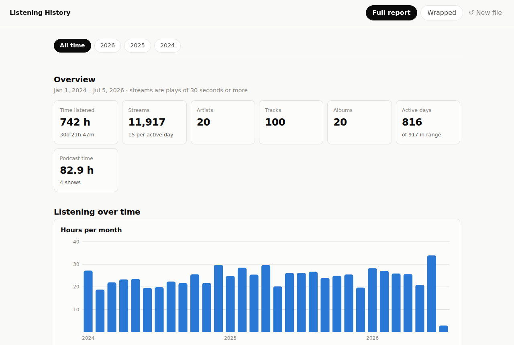
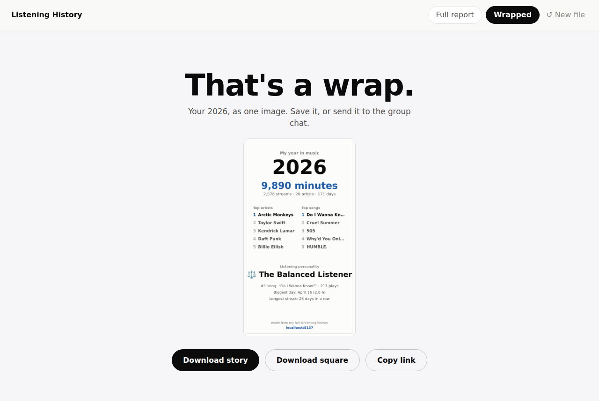

# Listening History

A quiet, content-first report for your Spotify streaming history export.

**Live: [mrfyda.github.io/spotify-steaming-history](https://mrfyda.github.io/spotify-steaming-history/)** — or try it with the built-in sample data.





Drop your Spotify data export zip on the page and get:

- **Full report** — an exhaustive, last.fm-style breakdown: overview stats, listening
  over time, listening clock, weekday × hour heatmap, searchable top artists / tracks /
  albums / podcasts, records & habits (streaks, biggest day, loop record, skip rate),
  platforms and countries. Filterable by year.
- **Wrapped** — a story-style, shareable recap for any year with fun facts, a listening
  personality, and a downloadable 1080×1920 share card.

Everything runs **entirely in the browser**. There is no server and no upload — the zip
is parsed with JavaScript on the page and never leaves your machine.

## Getting your data

1. Go to [spotify.com/account/privacy](https://www.spotify.com/account/privacy/)
2. Request either:
   - **Extended streaming history** — your full lifetime history (takes up to 30 days). Best results.
   - **Account data** — last year of streaming (a few days). Works, with fewer details.
3. Spotify emails you a zip. Drop it on the page as-is — no need to unpack.

Supported inputs: Spotify extended history zips (`Streaming_History_Audio_*.json`,
`Streaming_History_Video_*.json`, older `endsong_*.json`), Spotify account data zips
(`StreamingHistory*.json`), Apple Music exports from privacy.apple.com
(`Apple Music Play Activity.csv`, with `Play History Daily Tracks.csv` as a coarse
fallback), or those same `.json`/`.csv` files dropped directly.

A linkable demo with sample data lives at [`/demo`](https://mrfyda.github.io/spotify-steaming-history/demo/)
(it redirects to `?demo`). The Compare tab lets two people diff their histories three ways:
a live room (share a `?room=` link; both browsers swap compact summaries directly over an
encrypted WebRTC data channel, with the handshake brokered through public nostr relays via
Trystero — no server of ours), a ~100 KB summary file swapped over any chat, or the friend's
full export dropped and parsed locally. Whatever the path, only artist totals and headline
stats ever change hands, so the privacy promise holds for the friend too.

## Deployment

The site is static — `index.html` plus `assets/` and `vendor/`, no build step.
`.github/workflows/deploy-pages.yml` deploys to GitHub Pages on every push to `main`.

One-time setup: in the repo's **Settings → Pages**, set **Source** to **GitHub Actions**.

## Development

Serve the folder with any static server and open it:

```sh
python3 -m http.server 8000
```

The "Try it with sample data" button generates a synthetic three-year history, so you can
develop without a real export.

### Code layout

| File | Purpose |
|---|---|
| `assets/store.js` | Columnar play storage (typed arrays + string tables, ~35 B/play) behind a plain-object read API — keeps big histories from getting the tab evicted on mobile |
| `assets/parser.js` | Reads zips/JSON (JSZip), normalizes all export formats, streams records into the store |
| `assets/stats.js` | Aggregation engine — everything both views need, computed per time range |
| `assets/charts/core.js` | Chart plumbing: light/dark theme tokens, tooltip singleton, SVG + table-twin builders |
| `assets/charts/*.js` | One chart type per file (columns, streamgraph, radial, grids, constellation), each attaching to `Charts` |
| `assets/enrich.js` | Opt-in MusicBrainz lookups (genres, album years), batched and cached in localStorage |
| `assets/report/core.js` | Report shell: year filter, render loop, shared section/table helpers |
| `assets/report/*.js` | Report sections (overview, library, highlights, storyline, discovery, time, insights); each registers onto `Report._sections` and renders in script order |
| `assets/share.js` | Renders any chart card or top list to a branded PNG for the share sheet |
| `assets/summary.js` | Compact compare summary (artist totals + headline stats): build, validate, download |
| `assets/compare.js` | The Compare tab: live WebRTC rooms, summary files, or a locally parsed export — taste match + face-off |
| `assets/wrapped.js` | The Wrapped slides + canvas share card |
| `assets/sample.js` | Deterministic synthetic history for the demo button |
| `assets/main.js` | Drop zone, progress, view switching, invite routing; sheds rendered views while backgrounded |
| `vendor/trystero-nostr.min.js` | Trystero (MIT), bundled from npm with esbuild — WebRTC rooms with nostr-relay signaling |

A "stream" is counted when a play lasts ≥ 30 seconds (Spotify's own convention);
time totals always include every millisecond.

Not affiliated with Spotify.
